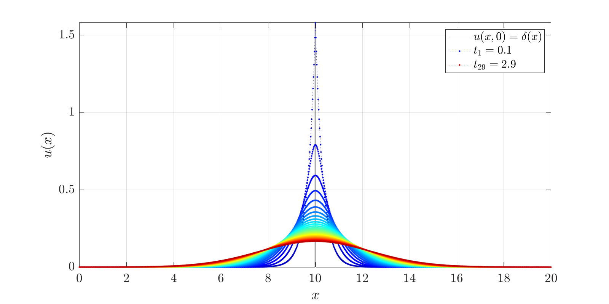
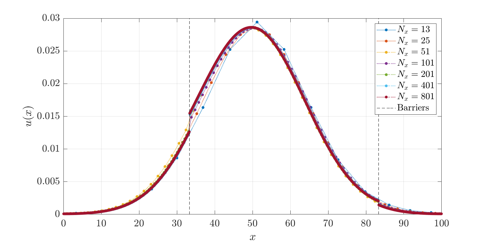
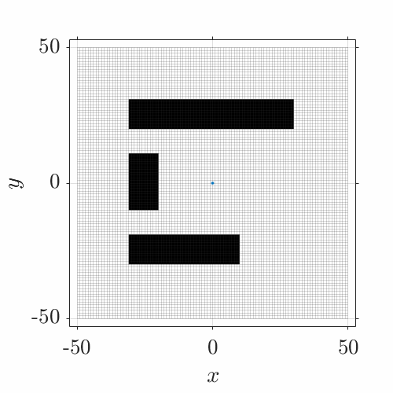

# Verifying Monte Carlo simulations using a finite volume method

This repository contains the code and methods presented at the [8th World Congress of Biomechanics](http://wcb2018.com).

## Installation

Installing the tools is as easy as calling:

```matlab
addpath('classes');
```

## Reference

### Data

[](https://doi.org/10.5281/zenodo.4495730)

### Conference presentation

> Rose et al. _Verifying Monte Carlo simulations of diffusion tensor cardiovascular magnetic resonance using a finite volume method_. 2018. 8th World Congress of Biomechanics, Dublin, Ireland.

## Examples

MATLAB scripts to create these graphics are located in the `.examples/` directory.

### Finite volume

First, we show a free diffusion case where the concentration spreads out from an initial spike in the center:



Next, we investigate the convergence of the solution with increased number of finite volumes. This example also includes permeable internal boundaries. Note that the step change in concentration across the boundaries is smeared when a too low resolution is chosen.



### Random walk

To illustrate the random walk, we generate an arbitrary domain with some restrictions and seed walkers in the center. See the animation below:


